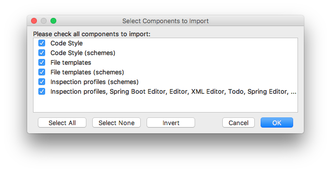
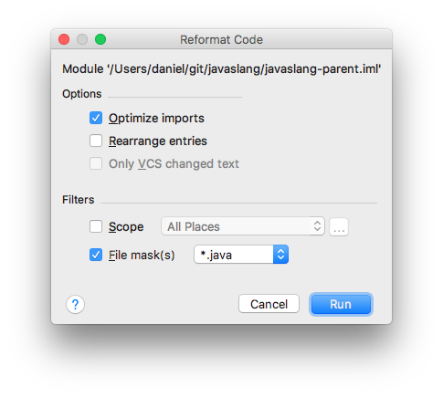

IntelliJ IDEA
-------------

The following IntelliJ IDEA settings contained:



We reformat only .java files.



After the code is reformatted we have to generate sources:

```bash
mvn clean package -DskipTests
```
