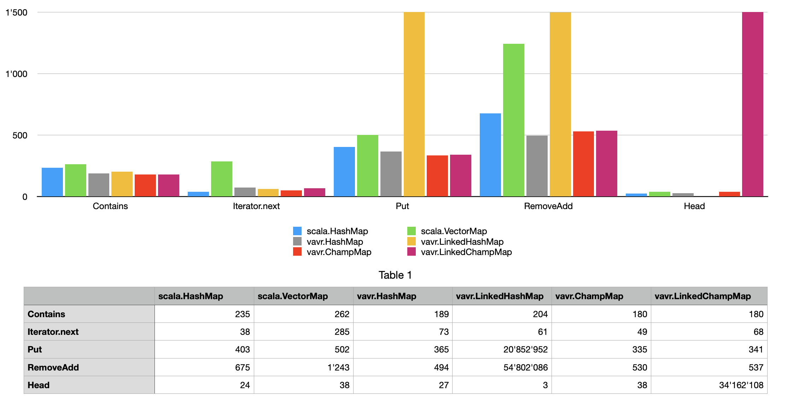

# Experimental fork of 'vavr' with CHAMP collections

## Status

This is an experimental fork of [github.com/vavr-io/vavr](https://github.com/vavr-io/vavr).

## CHAMP collections

This fork contains additional collections, that use
CHAMP (Compressed Hash-Array Mapped Prefix-tree) as their underlying data structures.
The collections are derived from [github.com/usethesource/capsule](https://github.com/usethesource/capsule),
and [github.com/wrandelshofer/jhotdraw8](https://github.com/wrandelshofer/jhotdraw8).

The collections are:

* ChampSet
* ChampMap
* LinkedChampSet
* LinkedChampMap

Each collection has a mutable partner:

* MutableChampSet
* MutableChampMap
* MutableLinkedChampSet
* MutableLinkedChampMap

## Performance characteristics

### ChampSet, ChampMap, MutableChampSet, MutableChampMap:

* Maximal supported size: 230 elements.
* Get/Insert/Remove: O(1)
* Head/Tail: O(1)
* Iterator creation: O(1)
* Iterator.next(): O(1)
* toImmutable/toMutable: O(1) + a cost distributed across subsequent updates of the mutable copy

The costs are only constant in the limit. In practice, they are more like
O(log32 N).

If a collection is converted from/to immutable/mutable, the mutual copy
of the collection loses ownership of all its trie nodes. Updates are slightly
more expensive for the mutable copy, until it gains exclusive ownership of all trie
nodes again.

### LinkedChampSet, LinkedChampMap, MutableLinkedChampSet, MutableLinkedChampMap:

* Maximal supported size: 230 elements.
* Get/Insert/Remove: O(1) amortized
* Head/Tail: O(N)
* Iterator creation: O(N)
* Iterator.next(): O(1)
* toImmutable/toMutable: O(1) + a cost distributed across subsequent updates of the mutable copy

The collections are not actually linked. The collections store a sequence number with
each data element. The sequence numbers must be renumbered from time to time, to prevent
large gaps and overflows/underflows.

When we iterate over the elements, we need to sort them.
We do this with a bucket sort in O(N) time. We achieve O(N) instead of O(N log N)
for the bucket sort, because we use at least N buckets, and no more than
N * 4 buckets.

Currently, the code contains a fall-back code for collections that grow larger than
230 elements. For very large collections the buckets do not fit into
a Java array anymore. We have to fall back to a heap.
With the heap, Iterator.next() needs O(log N) instead of O(1).

## Benchmarks

The following chart shows a comparison of the CHAMP maps with vavr collections
and with Scala collections. Scala org.scala-lang:scala-library:2.13.8 was used.

The collections have 1 million entries.

The y-axis is labeled in nanoseconds. The bars are cut off at 1'500 ns (!).
This cuts of the elapsed times of functions that run in linear times.

* **scala.HashMap** has a very competitive and balanced performance.
  It uses a CHAMP trie as its underlying data structure.
* **scala.VectorMap** has also a very competitive performance, removal and addition
  of entries is a bit slower than with most other collections.
  It uses a radix-balanced finger tree (Vector) and a CHAMP trie as its
  underlying data structure.
* **vavr.HashMap** has a very competitive and balanced performance.
  It uses a HAMP trie as its underlying data structure.
* **vavr.LinkedHashMap** has competitive query times, but updates need linear time.
  It uses a HAMP trie and a Banker's queue as its underlying data structure.
* **vavr.ChampMap** has a very competitive and balanced performance.
  It uses a CHAMP trie as its underlying data structure.
* **vavr.LinkedChampMap** has competitive performance except for accesses to the
  first/last entry. It uses a CHAMP trie and sequence numbers on the entries. 

